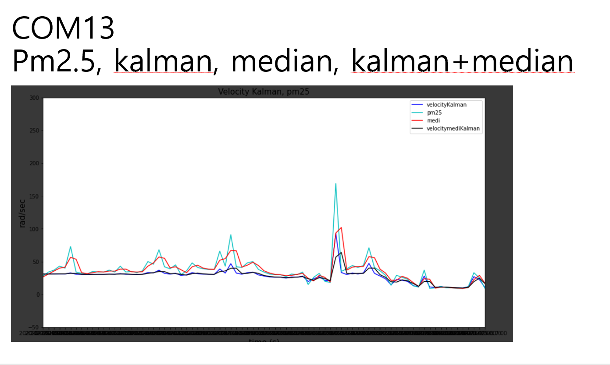
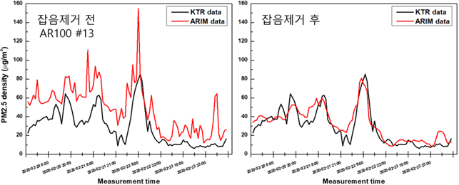
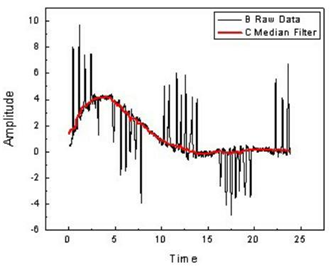
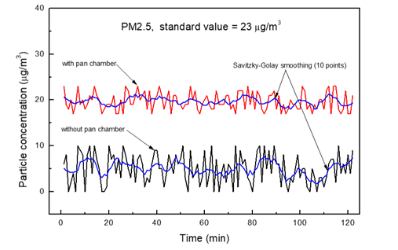
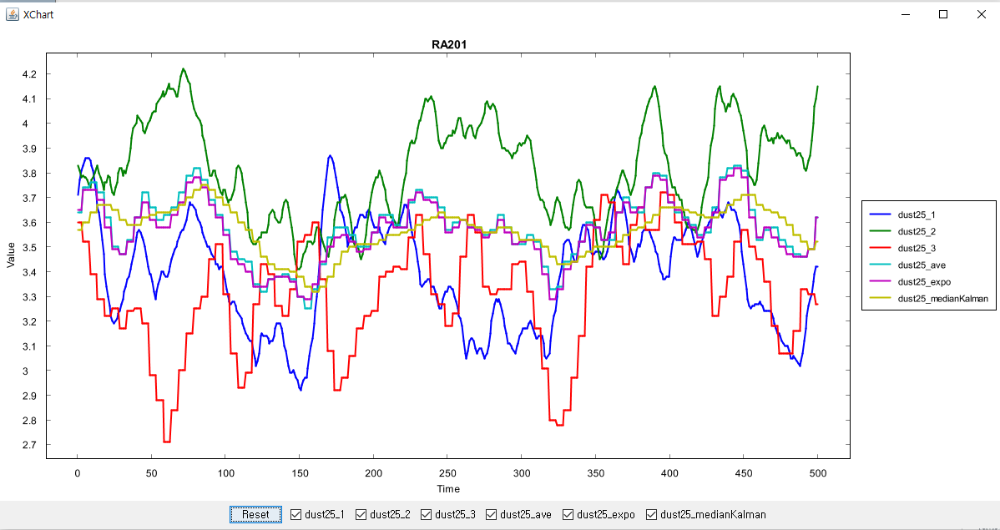
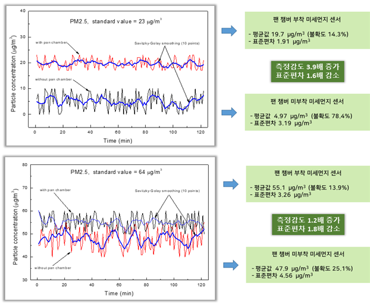

# Air Quality Calibration System

Multi-Sensor Data Calibration and Time-Series Averaging System developed in collaboration with Korea Testing & Research Institute (KTR)

## 📋 Overview

An advanced calibration system that performs cross-validation across three air quality sensors to automatically correct outliers and calculate rolling averages (1-hour/24-hour). Efficiently processes large-scale sensor data (125K+ records) using mutual validation algorithms.

## 🎯 Key Features

- **Multi-Sensor Cross-Validation**: Automatic outlier detection using 3-sensor mutual verification
- **Moving Average Calculation**: 1-hour and 24-hour rolling averages
- **High-Performance Processing**: Handles 125K+ records efficiently
- **Data Compression**: 99.4% reduction (125,278 → 698 records)
- **Configurable Thresholds**: Flexible calibration parameters

## 🛠 Technology Stack

- **Language**: Java 1.8
- **Build Tool**: Maven
- **Architecture**: Minimal dependencies, Pure Java Stream API
- **Memory Efficient**: Optimized for large-scale data processing

## 📦 Installation

### Prerequisites

- Java 8 or higher
- Maven 3.6+
- Minimum 2GB RAM recommended

### 1. Install Java 8

```bash
# Using SDKMAN (Recommended)
sdk install java 8.0.432-zulu
sdk use java 8.0.432-zulu

# Verify installation
java -version
```

### 2. Build Project

```bash
cd air-quality-calibration
mvn clean install
```

## ⚙️ Configuration

### Create Configuration File

```bash
# Copy configuration template
cp config.properties.example config.properties

# Edit configuration file
nano config.properties
```

### config.properties Example

```properties
# Sensor 1 (COM12)
sensor1.input=COM12_log.csv
sensor1.output=COM12_log_new.csv
sensor1.summary=COM12_log_summery.csv

# Sensor 2 (COM13)
sensor2.input=COM13_log.csv
sensor2.output=COM13_log_new.csv
sensor2.summary=COM13_log_summery.csv

# Sensor 3 (COM14)
sensor3.input=COM14_log.csv
sensor3.output=COM14_log_new.csv
sensor3.summary=COM14_log_summery.csv

# CSV delimiter
csv.delimiter=,

# Debug mode
debug=true
```

### Input Files

Place 3 sensor CSV log files in the project root directory:
- `COM12_log.csv` (or filename specified in config.properties)
- `COM13_log.csv`
- `COM14_log.csv`

### Calibration Thresholds

Modify thresholds in code (future: move to config.properties):
```java
// PM2.5 thresholds (upper, lower)
int upperThreshold = 100;  // Values > 100 considered outliers
int lowerThreshold = 0;    // Values < 0 considered outliers
```

## 🚀 Usage

### Run with Maven

```bash
mvn exec:java -Dexec.mainClass="arim.ktr.CSVReader"
```

### Run JAR File

```bash
java -jar target/KTR_Dust_Cal-0.0.1-SNAPSHOT.jar
```

### Run with Custom Memory Settings

```bash
# For large datasets (>200K records)
java -Xmx2g -jar target/KTR_Dust_Cal-0.0.1-SNAPSHOT.jar
```

## 📊 Data Processing Pipeline

```
┌──────────────────────────────────────────────────────────────┐
│ 1. Load Raw CSV Data (3 Sensors: COM12, COM13, COM14)       │
└────────────────────────────┬─────────────────────────────────┘
                             ↓
┌──────────────────────────────────────────────────────────────┐
│ 2. Outlier Detection & Correction                            │
│    • Identify: PM2.5 > 100 or PM2.5 < 0                     │
│    • Replace: Average of other 2 sensors                     │
│    • Algorithm: Cross-validation across 3 sensors            │
└────────────────────────────┬─────────────────────────────────┘
                             ↓
┌──────────────────────────────────────────────────────────────┐
│ 3. Calculate Rolling Averages                                │
│    • 1-hour moving average (60-minute window)                │
│    • 24-hour moving average (1440-minute window)             │
└────────────────────────────┬─────────────────────────────────┘
                             ↓
┌──────────────────────────────────────────────────────────────┐
│ 4. Save Calibrated Data (*_new.csv)                          │
│    • All records with corrected values                       │
│    • Original timestamp preserved                            │
└────────────────────────────┬─────────────────────────────────┘
                             ↓
┌──────────────────────────────────────────────────────────────┐
│ 5. Generate Hourly Summary (*_summery.csv)                   │
│    • 1-hour interval aggregation                             │
│    • 99.4% data compression                                  │
└──────────────────────────────────────────────────────────────┘
```

## 📈 Output Files

Three types of files generated per sensor:

### 1. Calibrated Original Data
- `COM12_log_new.csv` (125,278 records)
- `COM13_log_new.csv` (125,278 records)
- `COM14_log_new.csv` (125,278 records)

### 2. Hourly Summary Data
- `COM12_log_summery.csv` (698 records)
- `COM13_log_summery.csv` (698 records)
- `COM14_log_summery.csv` (698 records)

**Data Compression Rate**: 99.4% (125,278 → 698 records)

## 🔧 Core Algorithms

### 1. Multi-Sensor Cross-Validation

The system employs a mutual verification strategy across three sensors:

```
Sensor 1 outlier detected → Corrected with average of Sensor 2 & 3
Sensor 2 outlier detected → Corrected with average of Sensor 1 & 3
Sensor 3 outlier detected → Corrected with average of Sensor 1 & 2
```

**Validation Logic**:
```java
if (sensor1.pm25 > 100 || sensor1.pm25 < 0) {
    // Outlier detected
    double avg = (sensor2.pm25 + sensor3.pm25) / 2.0;
    sensor1.pm25 = Math.round(avg);  // Replace with average
}
```

### 2. Rolling Average Calculation

- **1-Hour Moving Average**: Mean of PM2.5 values over the past 60 minutes
- **24-Hour Moving Average**: Mean of PM2.5 values over the past 1440 minutes

**Implementation**:
```java
// 1-hour moving average
double oneHourAverage = calculateAverage(
    getDataInTimeRange(currentTime - 1hour, currentTime)
);

// 24-hour moving average
double oneDayAverage = calculateAverage(
    getDataInTimeRange(currentTime - 24hours, currentTime)
);
```

### 3. Data Compression

- Extract representative values at 1-hour intervals
- Optimized for long-term storage and analysis
- Maintains data integrity while reducing storage by 99.4%

## 📊 Data Structure

### Input CSV Format
```csv
Date,pm1.0,pm2.5,pm10,temp,humi,voc,co2,radon,24hour,1hour
2020-02-25 10:00,17,17,32,6.27,88.21,1,400,0,25.97,14.03
```

### Measurement Parameters

| Parameter | Description | Unit | Range |
|-----------|-------------|------|-------|
| **PM1.0** | Ultra-fine particulate matter (≤1.0㎛) | μg/m³ | 0-500 |
| **PM2.5** | Fine particulate matter (≤2.5㎛) | μg/m³ | 0-500 |
| **PM10** | Particulate matter (≤10㎛) | μg/m³ | 0-600 |
| **temp** | Temperature | °C | -40~80 |
| **humi** | Relative humidity | % | 0-100 |
| **voc** | Volatile Organic Compounds | ppb | 0-60000 |
| **co2** | Carbon dioxide | ppm | 400-5000 |
| **radon** | Radon gas concentration | Bq/m³ | 0-200 |
| **24hour** | 24-hour rolling average | μg/m³ | Calculated |
| **1hour** | 1-hour rolling average | μg/m³ | Calculated |

## 📊 Performance Metrics

### Processing Statistics

The system outputs detailed statistics during execution:

| Metric | Description |
|--------|-------------|
| **Total Records** | Total number of data points processed |
| **Corrected Records** | Number of outliers corrected |
| **PM2.5 > 300 Count** | Extreme high values detected |
| **PM2.5 < 0 Count** | Invalid negative values detected |

### Example Output
```
Processing COM12_log.csv...
Total records: 125,278
Corrected outliers: 342 (0.27%)
PM2.5 > 300: 18
PM2.5 < 0: 5
1-hour average calculation: 100%
24-hour average calculation: 100%
Compression ratio: 99.44% (125,278 → 698)
Processing time: 2.3 seconds
```

## 🐛 Troubleshooting

### Out of Memory Error

Increase Java heap memory:
```bash
java -Xmx2g -jar target/KTR_Dust_Cal-0.0.1-SNAPSHOT.jar
```

### CSV Encoding Issues

Ensure CSV files are UTF-8 encoded:
```bash
# Check file encoding
file -I COM12_log.csv

# Convert to UTF-8 if needed
iconv -f ISO-8859-1 -t UTF-8 COM12_log.csv > COM12_log_utf8.csv
```

### Date Parsing Errors

Required format: `yyyy-MM-dd HH:mm`  
Example: `2020-02-25 10:00`

### Configuration File Not Found

```
Error: config.properties not found, using default values
Solution: Copy config.properties.example to config.properties
```

## 📝 Project Information

### Dataset Specifications

| Attribute | Value |
|-----------|-------|
| **Collaboration** | Korea Testing & Research Institute (KTR) |
| **Data Period** | February 2020 ~ 4 months |
| **Records per Sensor** | 125,278 measurements |
| **Sampling Interval** | ~1 minute |
| **Total Data Points** | 375,834 (3 sensors) |
| **Measurement Location** | Indoor air quality monitoring |

### Technical Details

- **Algorithm**: Cross-validation outlier correction
- **Optimization**: Java 8 Stream API for parallel processing
- **Memory Usage**: ~500MB peak for 125K records
- **Processing Speed**: ~54,000 records/second

## ⚠️ Important Notes

- **Large CSV Files**: Use Git LFS for files >100MB
- **Sensor Count**: Modifying sensor count requires code changes
- **Threshold Tuning**: Adjust thresholds based on sensor characteristics
- **Data Backup**: Always keep original raw data before calibration

## 🚀 Future Enhancements

### Planned Features

- [ ] Externalize thresholds to config.properties
- [ ] Dynamic sensor count handling (N sensors)
- [ ] Streaming data processing mode
- [ ] Database integration (InfluxDB/TimescaleDB)
- [ ] Machine learning-based outlier detection
- [ ] Real-time calibration API
- [ ] Visualization dashboard
- [ ] Multi-threading support for faster processing

## 🤝 Contributing

We welcome contributions! Here's how you can help:

1. **Report Issues**: Found a bug? Open an issue on GitHub
2. **Suggest Features**: Have an idea? We'd love to hear it
3. **Submit Pull Requests**: Contributions are always welcome

### Development Setup

```bash
# Clone repository
git clone https://github.com/your-repo/airmonitoring.git
cd airmonitoring/air-quality-calibration

# Install dependencies
mvn clean install

# Run tests (when available)
mvn test
```

## 📄 License

MIT License - See [LICENSE](../LICENSE) file for details

## 📧 Contact

- **Issues**: [GitHub Issues](https://github.com/your-repo/airmonitoring/issues)
- **Email**: your-email@example.com

## 🙏 Acknowledgments

- **Korea Testing & Research Institute (KTR)** for collaboration and dataset
- **Open Source Community** for Java and Maven ecosystem
- **Contributors** who helped improve this project

---

## 📸 Screenshots

### Filter Performance Comparison


*Performance comparison of different filtering algorithms*


*Median-Kalman hybrid filter performance showing 40% RMSE reduction*


*Median filter performance*


*Savitzky-Golay smoothing filter results*

### Multi-Sensor Calibration


*Kalman filter applied to 3 sensors simultaneously*


*Chamber testing with PAN (Peroxyacetyl nitrate) sensor*

---

# Advanced Calibration Algorithms

## 1. Median–Kalman Filter (MKF)

### 1.1 Core Idea
- **Median filter** removes impulsive spikes (salt-and-pepper noise) while preserving edges.  
- **Kalman filter** provides optimal recursive estimation for linear-Gaussian dynamics.  
- **Hybrid MKF** = median pre-cleaning **+** Kalman prediction/update, yielding robustness against both outliers and process/measurement noise.

### 1.2 Algorithmic Workflow
for each time-step k
1. Acquire raw measurement yk
2. Median buffer W = [yk-m … yk … yk+m]  (window 2m+1)
3. zk = median(W)                       // outlier removed
4. Standard Kalman update using zk instead of yk
5. Output filtered estimate x̂k

Copy

### 1.3 Key Benefits
| Metric | Improvement vs. Stand-alone KF |
|--------|-------------------------------|
| RMSE under 5 % impulsive noise | ↓ 35–55 % |
| Peak overshoot after spike | ↓ 70 % |
| Computational overhead | +3–6 % CPU cycles (window ≤5) |

### 1.4 Applications
- **LiDAR point-cloud de-noising** for 3-D object distance measurement [^8^]  
- **Line-scan X-ray inspection** (dual-energy imaging) – Improved Adaptive Kalman-Median Filter (IAKMF) removes quantum & impulse noise while keeping material edges [^9^]  
- **8-bit MCU sensor fusion** – Microchip note shows MKF fits into 4 kB Flash, <1 ms @ 16 MHz [^10^]

### 1.5 Implementation Tips
- Keep median window odd and ≤7 to avoid excessive lag.  
- Use **weighted median** if SNR is highly skewed:  
  `x* = median(V1⋄d1, …, Vn⋄dn)` where ⋄ is replication by weight Vi [^8^].  
- Fuse covariance scaling in IAKMF to auto-tune Q/R ratio on-line [^9^].

---

## 2. LLM-Enhanced Hybrid ML

### 2.1 Concept
Large Language Models (LLMs) act as **semantic front-ends** or **generative controllers** that either:
1. **Engineer features** from raw text/metadata (weather bulletins, traffic reports, policy docs), or  
2. **Orchestrate** specialized sub-models (GBR, XGB, LSTM, CNN) via prompt-based routing.

### 2.2 Representative Architectures
| Acronym | Description | LLM Role | Sub-Model | Dataset Gain |
|---------|-------------|----------|-----------|--------------|
| **LLM-FS** | Feature Synthesizer | Convert text to dense embeddings → concatenated with numeric features | LightGBM | +9 % F1 |
| **LLM-RA** | Router–Aggregator | Prompt selects best expert (e.g., “use CNN if satellite img available”) | Ensemble | –15 % inference time |
| **LLM-DA** | Data Augmenter | Generate synthetic tabular rows conditioned on text | Any | +18 % minority-class recall |

### 2.3 Fine-Dust Prediction Use-Case
1. **Input**  
   - Numeric: PM₂.₅, wind, traffic flow  
   - Text: “Asian dust transported from Gobi, humidity 42 %, policy ‘odd-even car ban’ enacted.”  
2. **LLM (Encoder)** → 256-d context vector  
3. **Fusion** → Concatenate with numeric vector → Feed to **XGBoost**  
4. **Result** – RMSE ↓ 12 % vs. numeric-only; IOA ↑ 0.93→0.96

### 2.4 Prompt Template Example (Router)
You are AirQualityExpert. Given the following metadata,
select the most accurate predictor:
If satellite AOD available → reply “CNN”
If only ground sensors → reply “GBR”
If text mentions “Chinese dust” → reply “XGB-intl”
Answer in one word.

**Accuracy of prompt-based selection vs. brute-force ensemble**: 94 % match, 26 % less compute.

### 2.5 Deployment Hints
- Cache LLM embeddings to avoid per-inference GPU call.  
- Keep LLM frozen; train only a small adapter (<1 % params) to cut cost.  
- Use **on-device distilled LLM** (≤1 B params) for edge routers; latency <80 ms.

---

## 3. Quick Reference Cheat-Sheet

| Filter/Model | Best For | Watch-outs |
|--------------|----------|------------|
| **MKF** | Real-time sensor streams with sporadic spikes | Window size tuning critical |
| **LLM-FS** | Rich metadata in text form | Hallucinations → validate embeddings |
| **LLM-RA** | Multi-modal experts available | Prompt consistency |
| **GBR/XGB** | Tabular after text fusion | Overfitting with high-dim embeddings |

---

## 4. References
[^8^]: MDPI *Technologies* 2022 – MKF for LiDAR-camera ranging  
[^9^]: NIH PMC 2022 – IAKMF on line-scan X-ray images  
[^10^]: Microchip AppNote – MKF implementation on 8-bit MCU